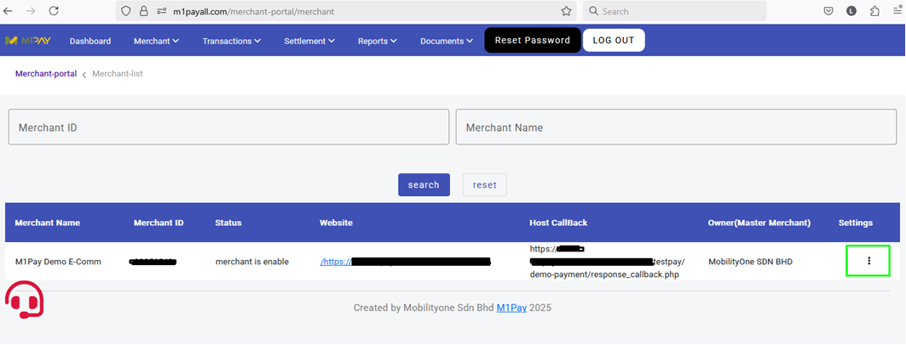
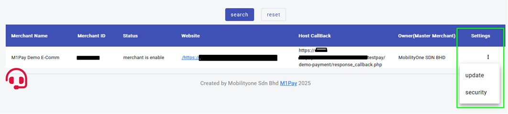
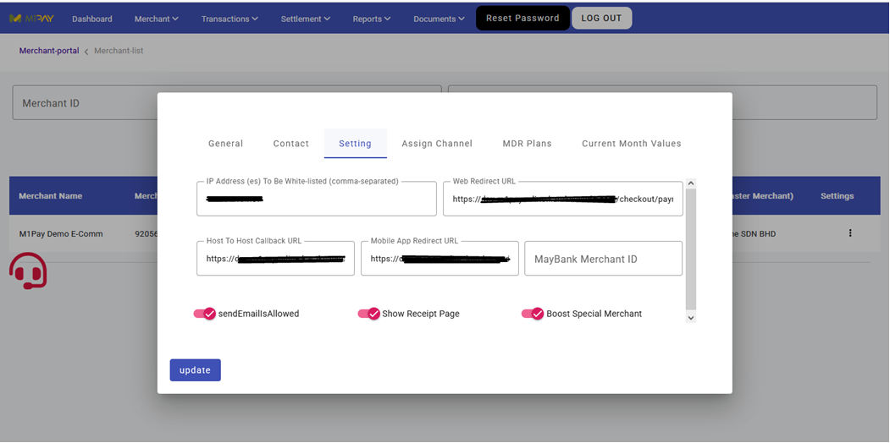
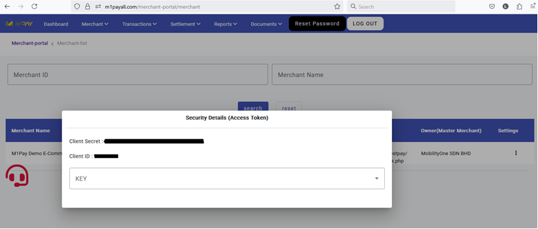
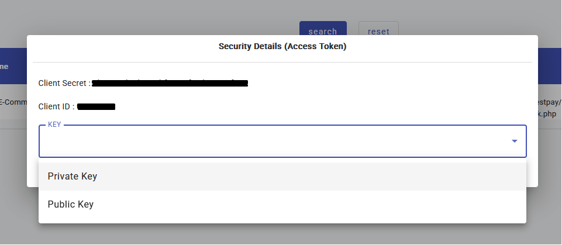

### Overview
This guideline is designed to assist merchants in integrating with the M1Pay Payment Gateway, particularly in the sandbox environment.

### Table of Contents
1. [Introduction](#introduction)
2. [Steps](#steps)

### Introduction
The following steps provide merchants with the necessary information to begin developing their M1Pay Payment Gateway integration.

### Steps
#### Step 1: Access the M1Pay Merchant Portal
- Navigate to the M1Pay Merchant Portal in the sandbox environment: [https://m1payall.com/merchant-portal](https://m1payall.com/merchant-portal).
- Set the **IP Address**, **Web Redirect URL**, and **Host to Host Callback URL** by selecting the **Merchant** tab and clicking **View Merchant**.  
  

#### Step 2: Update and Security Options
- Click the green box to reveal the **Update** and **Security** options.  
  

#### Step 3: Update Merchant Settings
- Select **Update** to access the merchant settings.
- Enter the **IP Address**, **Web Redirect URL**, and **Host to Host Callback URL**.  
  

#### Step 4: Retrieve Client ID and Client Secret
- In the **Security** section (refer to Step 2), locate the **Client ID** and **Client Secret**.  
  

#### Step 5: Download and Secure the Private Key
- Download the **Private Key** and store it securely on your server.
- This key is required to generate the `signedData` during transaction initiation with M1Pay.  
  

