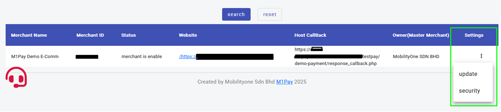

# Merchant Payment Setting Guidelines

## Overview
The initial guideline for merchant who needs to start payment integration with M1Pay especially in sandbox environment.

## Table of Contents
1. [Introduction](#introduction)
2. [Steps](#configuration-steps)  
  

## Introduction
The provided steps are to assist merchant to get the required information before start to develop the M1Pay Payment Gateway integration.

## Steps
1. **Step 1**: Go to M1Pay Merchant Portal in Sandbox environment ( https://m1payall.com/merchant-portal ), you need to set the IP address, Web Redirect URL and Host to Host Callback URL by clicking on tab menu “Merchant” >  “View Merchant” and you will get this page:  
  
    
  

2. **Step 2**: After you click on the green box, it will display “update” and “security”:  
  
  
  

3. **Step 3**: When click on “update”, it will appear the merchant setting and you may place the IP Address, Web Redirect URL and Host to Host Callback URL:  
  
  
  
  
4. **Step 4**: Get the Client ID and Client Secret. Refer in step #3, click on “security” and it should appear a page which contains of “Client ID” and “Client Secret”  as follows:  
  
    
  
  
5. **Step 5**: Download the “Private Key” and place it on your server securely. This will be used on generating the “signedData” during initiate the transaction in M1Pay.  
  
    
  